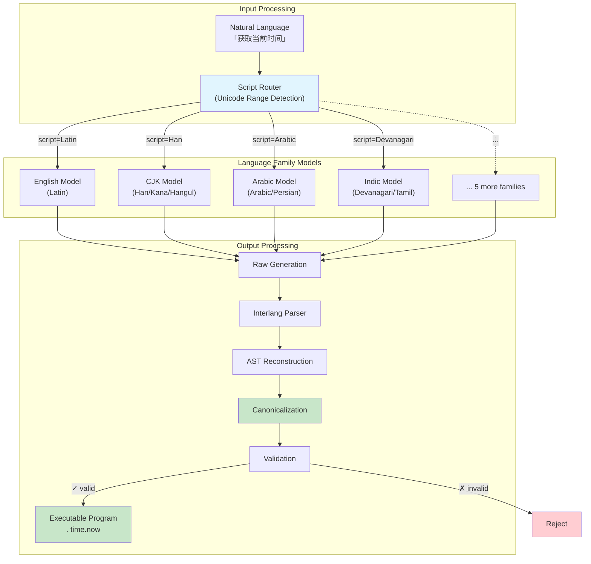

# FRAME Symbolic Model

> **Deterministic Intent Parsing via Constrained Language Model Fine-Tuning**

>Training pipeline for compact language models that perform *deterministic semantic parsing* mapping natural language utterances to structured, executable *interlang* programs. The architecture supports **9 language family models** with on device inference, automatic script based routing, and full unicode preservation.

---

## Abstract

Traditional language model outputs exhibit high variance and ambiguity, making them unsuitable for safety critical applications requiring reproducible execution semantics. This system addresses this limitation through a novel approach: training compact models to emit a *constrained intermediate representation* (interlang) that is:

1. **Deterministic** — identical inputs produce identical outputs under greedy decoding
2. **Verifiable** — all outputs undergo AST-level parsing, validation, and canonicalization
3. **Executable** — programs map directly to function calls with typed arguments
4. **Efficient** — low token count enables sub-100ms inference on edge devices

The key insight is that by reducing output entropy through structural constraints, we achieve higher effective model capacity for the semantic mapping task while eliminating the hallucination and ambiguity inherent in free-form generation.

---

## Architecture Overview



---

## Theoretical Foundation

### Entropy Reduction via Structural Constraints

Let $H(Y|X)$ denote the conditional entropy of model outputs given inputs. Standard autoregressive LMs optimize:

$$\mathcal{L}_{\text{LM}} = -\mathbb{E}_{(x,y) \sim \mathcal{D}} \left[ \sum_{t=1}^{T} \log P_\theta(y_t | y_{<t}, x) \right]$$

Our approach restricts the output space $\mathcal{Y}$ to the set of *valid interlang programs* $\mathcal{P} \subset \mathcal{Y}$, where $|\mathcal{P}| \ll |\mathcal{Y}|$. This constraint manifests through:

1. **Grammar-constrained generation** — outputs must parse under a deterministic CFG
2. **Canonicalization** — semantic equivalence classes collapse to unique representatives
3. **Validation** — post-hoc filtering rejects malformed outputs

The effective entropy reduction enables smaller models ($\sim$500M parameters) to achieve high accuracy on semantic parsing tasks where larger models ($\sim$7B+ parameters) are typically required for free-form generation.

### Multi-Family Factorization

Rather than training a single multilingual model with vocabulary overhead for all scripts, we factorize by *orthographic family*:

$$P(y|x) = \sum_{f \in \mathcal{F}} P(f|x) \cdot P(y|x, f)$$

Where $\mathcal{F} = \{\text{english}, \text{cjk}, \text{arabic}, \text{indic}, \ldots\}$ and $P(f|x)$ is computed via deterministic script detection (no learned routing). This enables:

- **Vocabulary efficiency** — each model's tokenizer is optimized for its script family
- **Parallel training** — families train independently on separate compute
- **Selective deployment** — load only required families on-device

---

## System Components

### Directory Structure

```
frame-symbolic-model/
├── interlang/
│   ├── parser.py          # Deterministic CFG parser (LL(1))
│   └── ast.py             # Op/Args type definitions
│
├── pipeline/
│   ├── canonicalize.py    # Canonical form serialization
│   ├── validate.py        # Structural + semantic validation
│   └── generate_dataset.py # LLM-based data augmentation
│
├── runtime/
│   ├── manifest.py        # Family registry loader
│   ├── router.py          # Script detection → family mapping
│   └── loader.py          # Dynamic GGUF model management
│
├── training/
│   ├── train_lora.py      # LoRA fine-tuning (per-family)
│   ├── infer.py           # HuggingFace inference
│   ├── dataset.py         # JSONL preprocessing
│   └── config.py          # Hyperparameter configuration
│
├── export/
│   ├── merge_model.py     # LoRA → merged checkpoint
│   ├── export_model.py    # HF → GGUF quantization
│   └── test_model.py      # GGUF validation suite
│
├── scripts/
│   ├── generate_canonical.py    # Base intent generation
│   ├── generate_variations.py   # Phrase augmentation
│   ├── generate_multilingual.py # Cross-lingual expansion
│   ├── split_by_family.py       # Family-wise partitioning
│   ├── validate_dataset.py      # Data quality assurance
│   └── translations.py          # Translation dictionary
│
├── models/
│   └── manifest.json      # Central family registry
│
└── data/
    ├── sample.jsonl       # Example training pairs
    └── canonical/         # Source intent templates
```

### Component Specifications

| Component | Responsibility | Complexity |
|-----------|----------------|------------|
| `interlang/parser.py` | Tokenization + LL(1) parsing | $O(n)$ where $n$ = input length |
| `pipeline/canonicalize.py` | AST → canonical string | $O(k \log k)$ per segment (key sorting) |
| `pipeline/validate.py` | Parse + regex constraints | $O(n)$ per program |
| `runtime/router.py` | Unicode codepoint analysis | $O(n)$ character scan |
| `runtime/loader.py` | GGUF loading + inference | $O(1)$ model swap, $O(m)$ generation |

---

## Interlang Specification

### Formal Grammar (EBNF)

```ebnf
program     = "." segment { (";" | "->") segment }
segment     = op { argument }
op          = IDENT
argument    = ":" key "=" value
key         = IDENT
value       = quoted_string | unquoted_token
quoted_string = '"' { UNICODE_CHAR } '"'
unquoted_token = ASCII_SAFE+

IDENT       = [a-zA-Z_][a-zA-Z0-9_.]*
ASCII_SAFE  = [A-Za-z0-9_./:@+-]
UNICODE_CHAR = <any unicode except unescaped '"'>
```

### Canonicalization Rules

1. All values serialized as double-quoted strings
2. Arguments sorted lexicographically by key within each segment
3. Consecutive duplicate `(op, args)` pairs collapsed
4. Segments joined with `" ; "` (space-delimited)
5. Program prefixed with `". "` (dot + space)

### Unicode Support

Quoted string values support full Unicode (UTF-8):

```
. memory.store :text="你好世界"           # Chinese
. memory.store :text="مرحبا بالعالم"      # Arabic
. memory.store :text="नमस्ते दुनिया"      # Hindi
. memory.store :text="Привет мир"        # Russian
```

Op names and argument keys remain ASCII-only for deterministic parsing.

---

## Training Pipeline

### Data Generation Flow


```bash
# Generate complete dataset pipeline
python scripts/generate_canonical.py      # 157 base intents
python scripts/generate_variations.py     # Expand to 497 variations
python scripts/generate_multilingual.py   # Translate to 9 languages
python scripts/split_by_family.py         # Split by script family
python scripts/validate_dataset.py        # Verify data quality
```

### LoRA Fine-Tuning

Per-family training with parameter-efficient fine-tuning:

```bash
python training/train_lora.py \
    --family english \
    --max-steps 2000 \
    --learning-rate 2e-4 \
    --batch-size 2 \
    --gradient-accumulation 8
```

**Hyperparameters (recommended):**

| Parameter | Value | Rationale |
|-----------|-------|-----------|
| Base model | `Qwen/Qwen2.5-0.5B` | Strong multilingual + small footprint |
| LoRA rank | 16 | Sufficient capacity for semantic mapping |
| LoRA alpha | 32 | Standard scaling factor |
| Learning rate | 2e-4 | Stable convergence |
| Max sequence length | 256 | Interlang programs are short |
| Training steps | 1000–3000 | Depends on dataset size |

### Export Pipeline

```bash
# Merge LoRA weights into base model
python export/merge_model.py --family english

# Quantize to GGUF (Q4_K_M recommended)
python export/export_model.py --family english

# Validate exported model
python export/test_model.py --family english
```

---

## Runtime Inference

### Automatic Routing

The router analyzes Unicode codepoint distributions to select the appropriate model:

```python
from runtime.loader import infer

# Automatic family detection
program, status, meta = infer("get current time")      # → english
program, status, meta = infer("获取当前时间")           # → cjk
program, status, meta = infer("الحصول على الوقت")      # → arabic
program, status, meta = infer("समय प्राप्त करें")       # → indic
```

### Manual Family Selection

```python
from runtime.loader import infer_with_family, load_model

# Force specific family
program, status, meta = infer_with_family("hello", "english")

# Explicit model loading
load_model("cjk")
```

### CLI Interface

```bash
# Auto-routing
python -m runtime.loader "get current time"

# Explicit family
python -m runtime.loader "获取当前时间" --family cjk

# Show stats
python -m runtime.loader "test" --stats
```

---

## Supported Language Families

| Family | Scripts | Languages | Example Input |
|--------|---------|-----------|---------------|
| `english` | Latin | English, Spanish, French, German, etc. | "get current time" |
| `cjk` | Han, Hiragana, Katakana, Hangul | Chinese, Japanese, Korean | "获取当前时间" |
| `arabic` | Arabic, Persian | Arabic, Farsi, Urdu | "الحصول على الوقت" |
| `indic` | Devanagari, Tamil, Telugu, Bengali | Hindi, Marathi, Tamil, etc. | "समय प्राप्त करें" |
| `cyrillic` | Cyrillic | Russian, Ukrainian, Bulgarian | "получить время" |
| `greek` | Greek | Greek | "λάβετε τον χρόνο" |
| `hebrew` | Hebrew | Hebrew, Yiddish | "קבל את הזמן" |
| `southeast_asian` | Thai, Lao, Khmer, Myanmar | Thai, Lao, Cambodian, Burmese | "รับเวลา" |
| `ethiopic` | Ethiopic | Amharic, Tigrinya | "ጊዜ ያግኙ" |

---

## Manifest Configuration

The `models/manifest.json` file serves as the central registry:

```json
{
  "version": "1.0",
  "default_family": "english",
  "families": {
    "english": {
      "gguf": "models/english/model.gguf",
      "adapter": "models/english/adapter",
      "base_model": "Qwen/Qwen2.5-0.5B",
      "scripts": ["latin"],
      "version": "1.0",
      "prompt_format": "<INPUT>\n{input}\n<OUTPUT>\n",
      "sha256": "",
      "size_mb": 0
    }
  }
}
```

---

## Formal Guarantees

| Property | Scope | Mechanism |
|----------|-------|-----------|
| **Determinism** | Parser, canonicalizer | Stateless, referentially transparent functions |
| **Validity** | Output programs | Post-hoc parsing + regex validation |
| **Canonicity** | Semantic equivalence | Unique representative per equivalence class |
| **Memory efficiency** | Runtime | Single model loaded at any time |
| **Unicode preservation** | Quoted values | UTF-8 throughout, `ensure_ascii=False` |

⚠️ **Important:** Model outputs may be invalid. Always validate every output before execution.

---

## Quick Start

```bash
# Clone and setup
git clone https://github.com/your-org/frame-symbolic-model.git
cd frame-symbolic-model
python -m venv .venv
source .venv/bin/activate
pip install -r requirements.txt

# Generate training data
python scripts/generate_canonical.py
python scripts/generate_variations.py
python scripts/generate_multilingual.py
python scripts/split_by_family.py
python scripts/validate_dataset.py

# Train (example: english family)
python training/train_lora.py --family english --max-steps 1000

# Export to GGUF
python export/merge_model.py --family english
python export/export_model.py --family english

# Test
python export/test_model.py --family english

# Inference
python -m runtime.loader "get current time"
```

---

## GCP Training (Cloud)

For large-scale training on Google Cloud Platform:

```bash
# Recommended instance: n1-standard-8 + NVIDIA T4/V100
# Storage: GCS bucket for checkpoints

# Install dependencies
pip install -r requirements.txt

# Train all families
for family in english cjk arabic indic cyrillic greek hebrew southeast_asian ethiopic; do
    python training/train_lora.py --family $family --max-steps 2000
    python export/merge_model.py --family $family
    python export/export_model.py --family $family
done
```

---

## Citation

If you use this system in your research, please cite:

```bibtex
@software{frame_symbolic_model,
  title  = {FRAME Symbolic Model: Deterministic Intent Parsing via Constrained LM Fine-Tuning},
  year   = {2026},
  url    = {https://github.com/frameprotocol/frame-symbolic-model}
}
```

---

## License

MIT License. See [LICENSE](LICENSE) for details.
